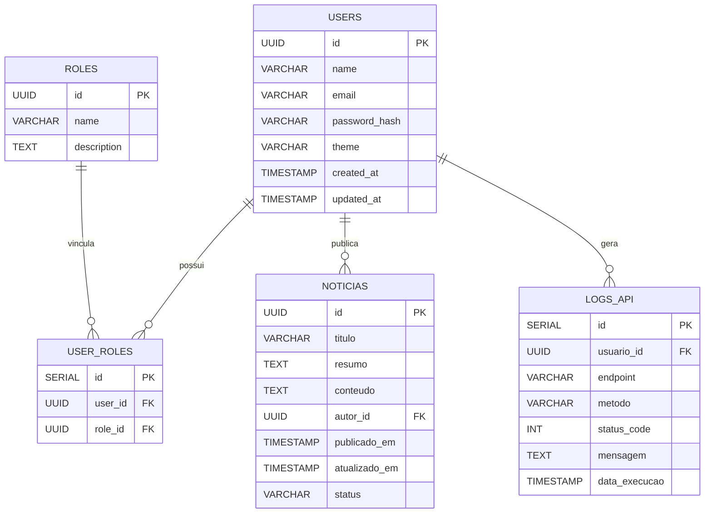

# 🧩 Arquitetura de Dados — PostgreSQL

> **Projeto:** Plataforma Fundep
> **Objetivo:** projetar o modelo de dados relacional que servirá o backend (Java Spring Boot), o CMS (Strapi) e integrações (.NET).
> **Banco:** PostgreSQL 15 (rodando em container Docker)

---

## ⚙️ 1. Objetivos da Modelagem

1. Definir uma estrutura **normalizada e segura** para autenticação, usuários e permissões.
2. Permitir integração fluida com **NextAuth** (via API Java) e **Strapi**.
3. Garantir rastreabilidade e escalabilidade para futuras funcionalidades (notícias, relatórios, calendários, logs).

---

## 🧱 2. Diagrama Conceitual (MER)

| USERS                | 1 n                    | USER_ROLES   |
| -------------------- | ---------------------- | ------------ |
| id (PK)              |                        | id (PK)      |
| name                 |                        | user_id (FK) |
| email                |                        | role_id (FK) |
| password_hash        | +--------------------+ |              |
| theme                |                        |              |
| created_at           |                        |              |
| updated_at           |                        |              |
|   |   |   |
|---|---|---|
|+------------------+|||

    `|     | 1     | n`

+------------------+

| ROLES                |
| -------------------- |
| id (PK)              |
| name                 |
| description          |
| +------------------+ |

| NOTICIAS             |
| -------------------- |
| id (PK)              |
| titulo               |
| resumo               |
| conteudo             |
| autor_id (FK)        |
| publicado_em         |
| atualizado_em        |
| status               |
| +------------------+ |

|LOGS_API|
|---|
|id (PK)|
|usuario_id (FK)|
|endpoint|
|metodo|
|status_code|
|mensagem|
|data_execucao|
|+-------------------+|
## 🧩 3. Script SQL — Criação de Tabelas

```sql
-- =============================
--  DATABASE: FUNDEP_PLATFORM
-- =============================

CREATE EXTENSION IF NOT EXISTS "uuid-ossp";

-- ------------------------------
--  TABELA: ROLES
-- ------------------------------
CREATE TABLE roles (
    id UUID PRIMARY KEY DEFAULT uuid_generate_v4(),
    name VARCHAR(50) UNIQUE NOT NULL,
    description TEXT
);

INSERT INTO roles (name, description) VALUES
('ADMIN', 'Acesso total ao sistema'),
('USER', 'Usuário padrão do portal'),
('EDITOR', 'Gerencia conteúdos e notícias');

-- ------------------------------
--  TABELA: USERS
-- ------------------------------
CREATE TABLE users (
    id UUID PRIMARY KEY DEFAULT uuid_generate_v4(),
    name VARCHAR(120) NOT NULL,
    email VARCHAR(120) UNIQUE NOT NULL,
    password_hash VARCHAR(255) NOT NULL,
    theme VARCHAR(20) DEFAULT 'system',
    created_at TIMESTAMP DEFAULT CURRENT_TIMESTAMP,
    updated_at TIMESTAMP DEFAULT CURRENT_TIMESTAMP
);

-- ------------------------------
--  TABELA: USER_ROLES
-- ------------------------------
CREATE TABLE user_roles (
    id SERIAL PRIMARY KEY,
    user_id UUID NOT NULL REFERENCES users(id) ON DELETE CASCADE,
    role_id UUID NOT NULL REFERENCES roles(id) ON DELETE CASCADE
);

-- ------------------------------
--  TABELA: NOTICIAS
-- ------------------------------
CREATE TABLE noticias (
    id UUID PRIMARY KEY DEFAULT uuid_generate_v4(),
    titulo VARCHAR(255) NOT NULL,
    resumo TEXT,
    conteudo TEXT,
    autor_id UUID REFERENCES users(id),
    publicado_em TIMESTAMP DEFAULT CURRENT_TIMESTAMP,
    atualizado_em TIMESTAMP DEFAULT CURRENT_TIMESTAMP,
    status VARCHAR(20) DEFAULT 'PUBLICADO'
);

-- ------------------------------
--  TABELA: LOGS_API
-- ------------------------------
CREATE TABLE logs_api (
    id SERIAL PRIMARY KEY,
    usuario_id UUID REFERENCES users(id),
    endpoint VARCHAR(255),
    metodo VARCHAR(10),
    status_code INT,
    mensagem TEXT,
    data_execucao TIMESTAMP DEFAULT CURRENT_TIMESTAMP
);
```


---
## 🧩 4. Relacionamentos e Regras

|Entidade|Tipo|Descrição|
|---|---|---|
|`users`|principal|Armazena usuários autenticados|
|`roles`|dicionário|Define permissões e papéis|
|`user_roles`|relação N:N|Liga usuários e roles|
|`noticias`|conteúdo|Gerenciado via Strapi (CMS)|
|`logs_api`|auditoria|Armazena logs de uso da API Java|

---
## 🔐 Regras de negócio:

- Um usuário pode ter várias **roles**.

- Apenas usuários com role `ADMIN` ou `EDITOR` podem **criar/editar** notícias.

- O campo `theme` pode ser sincronizado com o NextAuth (`next-themes`).

- Todos os acessos de API são registrados em `logs_api`.

---

## 🔐 Regras de negócio:

Um usuário pode ter várias roles.

Apenas usuários com role ADMIN ou EDITOR podem criar/editar notícias.

O campo theme pode ser sincronizado com o NextAuth (next-themes).

Todos os acessos de API são registrados em logs_api.

---

## 🧩 5. Diagrama ER — Modelo de Dados (Mermaid)


