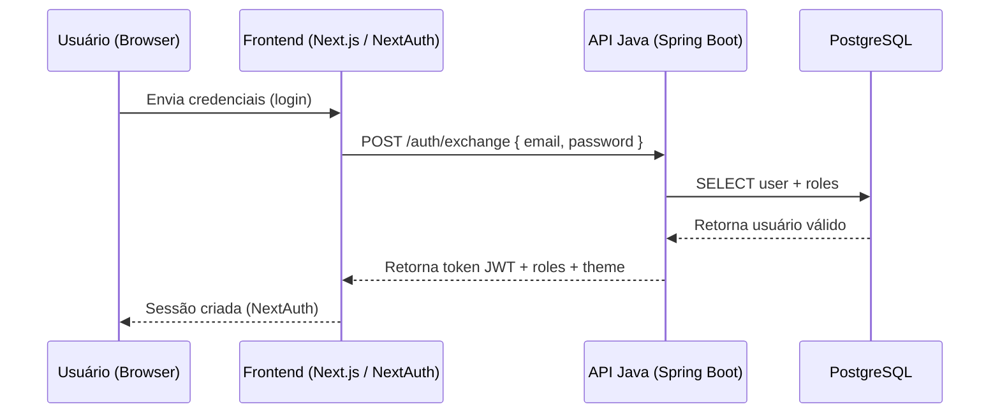
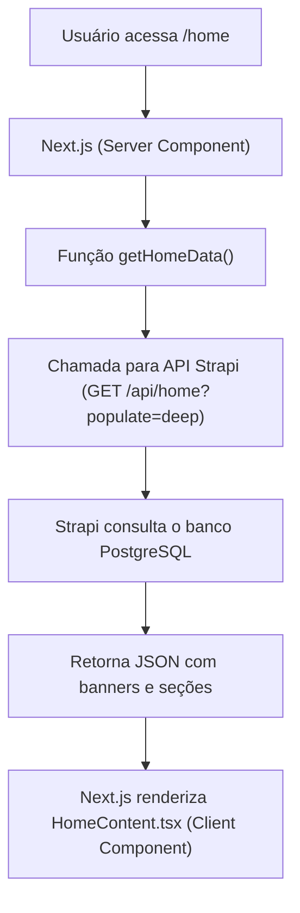
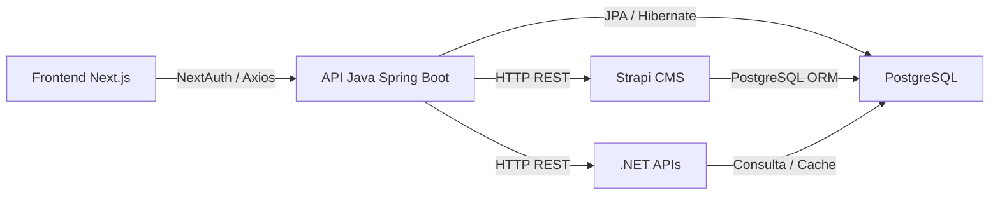
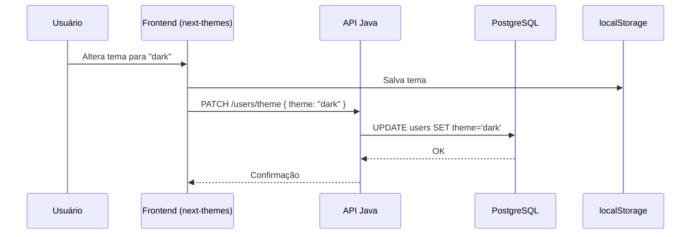
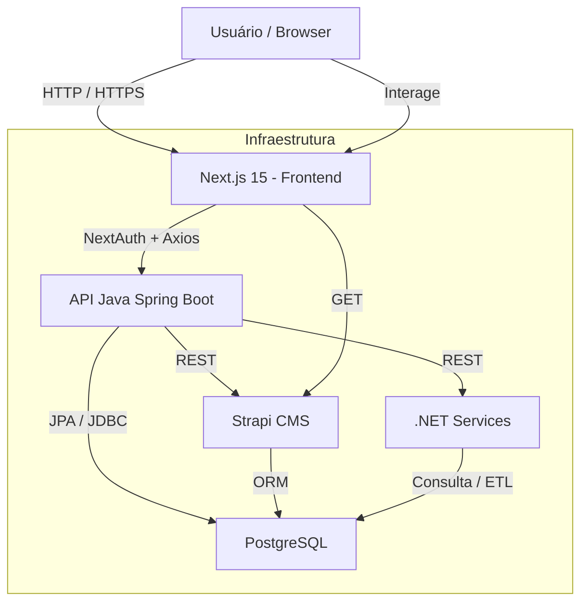

# 🏗️ Arquitetura de Sistema — Fundep Platform

> **Projeto:** Plataforma Fundep
> **Escopo:** integração entre módulos Frontend (Next.js), Backend (Spring Boot), Banco de Dados (PostgreSQL), CMS (Strapi) e APIs .NET.
> **Objetivo:** apresentar o fluxo completo de autenticação, comunicação e troca de dados no ecossistema da aplicação.

---

## ⚙️ 1. Visão Geral

A arquitetura segue o padrão **modular e escalável**, separando responsabilidades:

Frontend (Next.js)
↓
Backend API (Spring Boot)
↓
PostgreSQL (Banco de Dados)
↓
+----------------+
| Serviços Externos |
| • Strapi (CMS) |
| • .NET APIs |
+----------------+

Cada módulo é independente, containerizado via **Docker Compose**, e comunica-se por HTTP/REST, autenticado por **JWT** e **NextAuth**.

---

## 🧩 2. Componentes Principais


| Módulo | Tecnologia | Função |
|--------|-------------|--------|
| **Frontend** | Next.js 15 + TypeScript | Interface web (SSR/CSR), controle de acesso e tema |
| **Backend** | Spring Boot 3 + Java 21 | API REST, autenticação OAuth2, orquestração de dados |
| **Banco de Dados** | PostgreSQL 15 | Persistência de usuários, roles, logs e preferências |
| **CMS** | Strapi 5 | Gerenciamento de conteúdo (notícias, banners, eventos) |
| **Serviços Externos** | .NET / C# | Módulos específicos (relatórios, calendários, gráficos) |
| **Infraestrutura** | Docker + Compose | Contêinerização e rede local integrada |
| **Monitoramento** | New Relic + Grafana | Observabilidade e métricas de desempenho |

---

## 🔐 3. Fluxo de Autenticação

**Objetivo:** validar usuário, gerar token JWT e repassar para o NextAuth.



💡 O token JWT inclui:
```json
{
  "sub": "user_id",
  "email": "user@fundep.br",
  "roles": ["ADMIN", "USER"],
  "theme": "dark",
  "exp": "2025-01-15T10:00:00Z"
}
```

---

## 🧠 4. Fluxo de Dados (Home / Notícias)


- **Home e Notícias** usam SSR (Server-Side Rendering) com revalidate configurado.

- O cache é controlado pelo Next.js e pode ser renovado manualmente via revalidate API.

- Strapi acessa as mesmas tabelas PostgreSQL que o backend Java.

---

## 🧾 5. Integração entre Módulos


### 🔗 Comunicação:

- Todas as comunicações são **via HTTPS e Bearer Token**.

- O backend Java atua como **API Gateway** para Strapi e .NET quando necessário.

---

## 📊 6. Fluxo de Tema e Preferências



Na próxima sessão de login, o backend retorna `theme` dentro do payload do token.

---
## 🧩 7. Padrão de Comunicação entre Serviços

| Origem   | Destino    | Protocolo   | Autenticação    |
| -------- | ---------- | ----------- | --------------- |
| Next.js  | Java API   | HTTPS REST  | NextAuth (JWT)  |
| Java API | PostgreSQL | JDBC        | Driver oficial  |
| Java API | Strapi     | HTTPS REST  | Bearer Token    |
| Java API | .NET API   | HTTPS REST  | API Key / Token |
| Strapi   | PostgreSQL | ORM interno | Nativo          |
| .NET API | PostgreSQL | EF Core     | Nativo          |

---
## 📦 8. Docker Compose (Resumo da Orquestração)

```yaml
version: "3.9"
services:
  web:
    build: ./frontend
    ports:
      - "3000:3000"
    depends_on:
      - api-java
    environment:
      - NEXTAUTH_URL=http://localhost:3000
      - NEXT_PUBLIC_API_BASE=http://api-java:8080

  api-java:
    build: ./backend
    ports:
      - "8080:8080"
    environment:
      - DB_HOST=db
    depends_on:
      - db

  strapi:
    image: strapi/strapi
    environment:
      - DATABASE_CLIENT=postgres
      - DATABASE_HOST=db
    ports:
      - "1337:1337"

  dotnet:
    build: ./dotnet
    ports:
      - "5000:5000"

  db:
    image: postgres:15
    ports:
      - "5432:5432"
    environment:
      - POSTGRES_DB=fundep_db
      - POSTGRES_USER=fundep_user
      - POSTGRES_PASSWORD=fundep_pass
```

---

## 🧩 9. Observabilidade e Logs

|Serviço|Ferramenta|Finalidade|
|---|---|---|
|Next.js|New Relic (Node Agent)|APM do front|
|API Java|Spring Boot Actuator|Healthcheck e métricas|
|PostgreSQL|pgAdmin / Grafana|Monitoramento do banco|
|Docker|Prometheus|Logs e métricas de containers|

---
## 🧱 10. Diagrama de Arquitetura Completa (Mermaid)


---
## 🧭 11. Benefícios da Arquitetura

✅ Separação clara de responsabilidades
✅ Fácil manutenção e escalabilidade
✅ Frontend independente de APIs externas
✅ Suporte a SSR/CSR e i18n
✅ Segurança via OAuth2 e JWT
✅ Reuso de dados entre Strapi e Java
✅ Totalmente containerizado (Docker Compose)

---

[^1]📘 **Autor:** Wemerson Pereira
📅 **Última atualização:** {{data_atual}}

[^1]: Autor Wemerson
