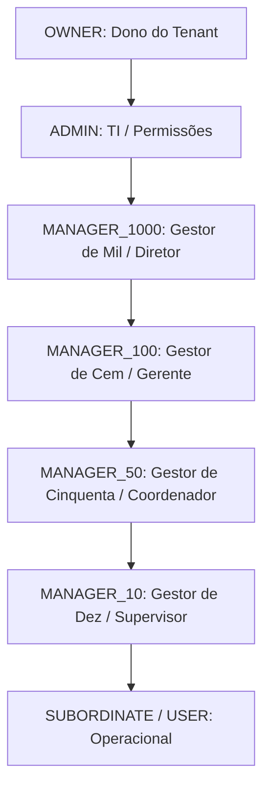

# Documentação UML e Arquitetura - Escala SaaS

Este documento detalha a estrutura de classes, componentes e banco de dados do projeto, abstraindo detalhes de implementação.

## 1. Visão Geral da Arquitetura
A plataforma utiliza o padrão **BFF (Backend For Frontend)** e **Arquitetura Hexagonal** no frontend para isolar o domínio de mudanças externas.

### Fluxo de Comunicação
`UI Components <-> BFF (Next.js Routes) <-> Application Services <-> Adapters <-> Spring Boot API`

---

## 2. UML Frontend (Camadas Hexagonais)

### Camada de Domínio (Core Models)
```typescript
interface UserProfile {
  id: string;
  username: string;
  email: string;
  roles: string[];
  address: Address;
}

interface Company {
  id: string;
  name: string;
  cnpj: string;
  latitude: number;
  longitude: number;
}

interface TeamInvitation {
  token: string;
  email: string;
  roleName: string;
}
```

### Camada de Aplicação (Services)
*   **UserService:** Orquestra autenticação e perfil.
*   **CompanyService:** Gere dados das unidades e geofencing.
*   **InvitationService:** Processa convites e onboarding.
*   **ReportService:** Gera e exporta dados financeiros.

### Camada de Infraestrutura (Adapters)
*   **BackendAdapter:** Gerencia o `fetch` para o Spring Boot com Bearer Token.
*   **MapAdapter:** Encapsula Leaflet/Google Maps.
*   **ExternalService:** Integração com BrasilAPI.

---

## 3. UML Backend (Spring Boot Core)

### Diagrama de Classes (Entidades Principais)
*   **User:** (id, username, email, password, theme, active, company_id)
*   **Company:** (id, name, slug, cnpj, theme, active, latitude, longitude, allowed_radius)
*   **Sector:** (id, name, description, max_seats, company_id, manager_id)
*   **WorkPost:** (id, name, description, company_id, project_id)
*   **Employee:** (id, full_name, email, user_id, sector_id, project_id, company_id, active)
*   **WorkShift:** (id, employee_id, shift_date, start_time, end_time, status, work_mode, padrao_escala, notes, version)
*   **OperationalCapacity:** (id, target_id, target_type, day_of_week, start_time, end_time, min_employees_required, company_id)
*   **Message:** (id, sender_id, receiver_id, type, title, content, status, metadata, company_id, created_at, decided_at)
*   **TeamInvitation:** (id, email, token, expires_at, company_id, invited_by, role_name)

### Hierarquia ReBAC (Modelo Jethro de Delegação)


### Camada de Serviço
*   **AuthenticationService:** Registro/Login com multi-tenancy.
*   **ScheduleService:** Gestão de escalas, validação de leis trabalhistas e regras ReBAC de visibilidade do gestor.
*   **OrganizationService:** Gestão de setores, projetos e postos de trabalho com controle de responsabilidade.
*   **MessageService:** Central de notificações, roteamento de mensagens dinâmicas e validação de permissões.
*   **AiMessageService:** Integração de WhatsApp/Telegram com NLP/LLMs para alocação automática de substitutos.

---

## 4. Diagrama de Banco de Dados (PostgreSQL)

| Tabela | Colunas Chave / Constraints | Relacionamentos |
|:---|:---|:---|
| **companies** | id (PK), slug (UK), cnpj | 1:N com users, 1:N com sectors |
| **users** | id (PK), email (UK), company_id (FK) | N:N com roles, 1:1 com employees |
| **sectors** | id (PK), company_id (FK), manager_id (FK) | N:1 com companies, N:1 com users (Manager) |
| **work_posts** | id (PK), project_id (FK), company_id (FK) | N:1 com projects, N:1 com companies |
| **employees** | id (PK), user_id (FK), sector_id (FK), company_id (FK) | 1:1 com users, N:1 com sectors |
| **work_shifts** | id (PK), employee_id (FK), version (int8) | N:1 com employees |
| **operational_capacities** | id (PK), target_id, target_type, company_id (FK) | Regras de efetivo operacional mínimo |
| **messages** | id (PK), sender_id (FK), receiver_id (FK), company_id (FK) | Fluxo de notificações e permissões dinâmicas |

---

## 5. O Papel do Strapi (CMS)
Nesta arquitetura, o **Strapi** atua exclusivamente como um provedor de conteúdo dinâmico de marketing e UI:
*   **Menus:** Itens de navegação do header público.
*   **Banners:** Carrosséis promocionais na Landing Page.
*   **Artigos:** Conteúdo do Blog de Gestão.
*   **Footer:** Links e textos institucionais.
*   **Landing Pages:** Segmentação de marketing por indústria e campanhas.

