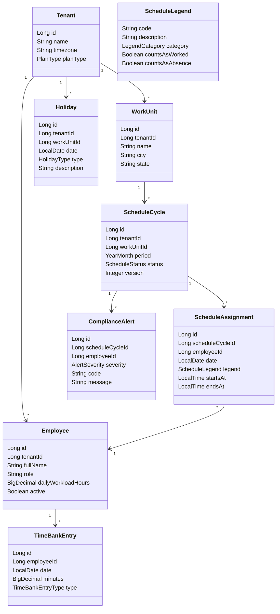
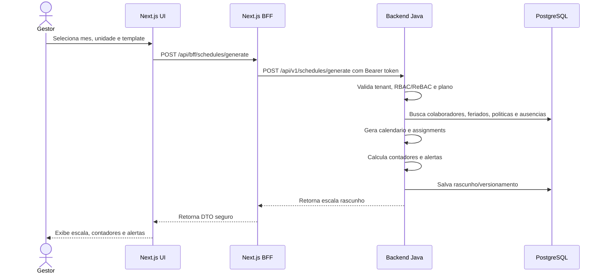

# Plano de implementacao — Gestao mensal inteligente de escalas

Data de referencia: 2026-06-30.

## 1. Contexto

O projeto busca evoluir um SaaS B2B multi-tenant de gestao inteligente de escalas, jornada, banco de horas, ponto, postos, geolocalizacao, IA, trial comercial e captura de leads.

A stack real auditada e:

- Frontend principal: `Frontend/web-app3/escala`, Next.js 16, React 19, TypeScript, Tailwind, NextAuth, BFF via Route Handlers e `proxy.ts`.
- Backend oficial: `Backend/java-app1/demo`, Spring Boot 4.1.0, Java 25, Maven, PostgreSQL, JWT, Swagger manual e dominio inicial de escala.
- CMS: `Backend/cms-strapi`, Strapi v5 restrito a conteudo editorial, SEO, menus, legal pages, landing pages, campanhas e formularios editoriais.
- Banco: PostgreSQL em Docker, com separacao de banco/usuario para backend e Strapi.

Diretriz de produto: entrar por escala mensal correta para PMEs, com templates, feriados, contadores, alertas e publicacao auditavel. Ponto completo, banco de horas avancado, dimensionamento e IA devem evoluir por fases.

## 2. Evidencias do projeto

### 2.1 Frontend e BFF

- Existem rotas publicas para home, campanhas, landing pages, demo, contato, login, cadastro e convites.
- Existem rotas privadas para dashboard, escala, auditoria, marketing, relatorios, empresas, setores, projetos, ReBAC, time, perfil, billing, configuracoes, aprendizado e Escala Inteligente.
- O BFF cobre leads, check-in, escala, schedules, scheduling, swap requests, relatorios, auditoria, billing, IA, organizacao, funcionarios, empresas, mensagens, ReBAC, stats e external utilities.
- O pacote `@brazilian-utils/brazilian-utils` ja esta disponivel para validacoes/formatacoes brasileiras.

### 2.2 Backend

- `MarketingLead` ja registra email, nome, empresa, origem, consentimento, UTM, referrer, landing page e campanha.
- `TimeRecord` ja registra ponto web basico com usuario, horario, tipo, IP, latitude, longitude e device fingerprint.
- `CheckInService` valida empresa, plano, geolocalizacao e raio permitido antes de persistir `TimeRecord`.
- `ScheduleService` ja possui criacao/listagem/atualizacao/cancelamento de escalas, troca de escala, validacao de regras trabalhistas e auditoria basica.
- `LaborRuleEngine` ja cobre regras iniciais de jornada, descanso e padroes 5x2, 6x1 e 12x36.
- Existem estruturas de ReBAC, capacidade operacional, work posts, billing, assinatura e IA mock.

### 2.3 Strapi

- Existem content types editoriais para landing pages, segmentos, features, planos, FAQ, artigos, menus, footer, legal pages e lead forms.
- `lead-form` deve ser tratado como configuracao editorial do formulario. A persistencia do lead e a qualificacao operacional devem continuar no Spring Boot.

### 2.4 Lacunas principais

- Lead ainda nao captura telefone normalizado, segmento, faixa de colaboradores, classificacao de email pessoal/corporativo e versao de consentimento.
- Nao ha entidade robusta de `CampaignAttribution` separada de `MarketingLead`.
- A Escala Inteligente ja possui ciclo de rascunho, validacao, publicacao, retificacao, arquivamento, contadores e alertas na API e na UI, mas ainda depende de `cycleId` para reabrir um ciclo especifico.
- Feriados configuraveis por tenant/unidade ja viraram modulo inicial, inclusive com BFF e UI.
- Banco de horas ainda nao possui modelo completo de saldo, politica, compensacao e expiracao.
- Ponto web basico nao equivale a REP-P/Portaria 671.
- OpenAPI manual precisa acompanhar qualquer endpoint REST novo.

### 2.5 Estado implementado da Escala Inteligente

Ja existe entrega funcional no frontend principal com:

- pagina SSR em `/dashboard/escala/inteligente`
- consumo dos endpoints de `SchedulingController`
- grade mensal de atribuicoes por colaborador x dia
- save bulk do ciclo via `PATCH /cycles/{id}/assignments`
- contadores e alertas por ciclo
- ciencia de alertas
- acoes de validar, publicar, retificar e arquivar
- operacoes de produtividade:
  - preencher semana inteira
  - copiar escala mensal de um colaborador para outro
  - presets `5x2`, `6x1`, `12x36`
  - dif visual antes do PATCH bulk

### 2.6 Gaps restantes da entrega

- criar listagem de ciclos por mes/unidade para navegação sem `cycleId` manual
- decidir se presets de template devem permanecer como helper de UI ou migrar para endpoint backend dedicado
- evoluir validacoes de cobertura minima, lotacao maxima e ausencias bloqueantes na experiencia de produto
- criar experiencia de mural/visualizacao da escala publicada para colaborador

## 3. Requisitos funcionais

### RF01 — Cadastro e qualificacao de lead

O sistema deve registrar leads vindos de formularios publicos com dados pessoais minimos, dados da empresa, faixa de colaboradores, segmento, UTM/referrer, origem, landing/campanha e consentimentos.

Critérios:

- Validar campos no frontend com Zod e no backend com regras proprias.
- Marcar email pessoal usado em campo corporativo.
- Salvar telefone normalizado e preparar formato E.164.
- Registrar origem de campanha e landing page.
- Evoluir `MarketingLead` e, se necessario, criar `CampaignAttribution`, `LeadConsent` e recomendacao inicial de plano/template.
- Strapi pode definir os campos/editorial do formulario; Spring Boot deve persistir o lead.

### RF02 — Calendario mensal de escala

O sistema deve gerar automaticamente os dias do mes e dias da semana com base em mes, ano, timezone e unidade.

Critérios:

- Retornar `date`, `dayOfWeek`, `weekend`, `holiday`, `holidayDescription`.
- Suportar meses com 28, 29, 30 e 31 dias.
- Nao calcular regra critica exclusivamente no frontend.

### RF03 — Feriados configuraveis

O sistema deve permitir CRUD de feriados por tenant e unidade.

Critérios:

- Tipos: nacional, estadual, municipal e customizado.
- Feriado impacta alertas, relatórios e calculo de remuneracao.
- Manter auditoria de criacao, alteracao e exclusao logica.
- BrasilAPI e bibliotecas utilitarias podem alimentar sugestoes, mas a regra aplicada deve ser persistida no backend.

### RF04 — Templates de escala

O sistema deve gerar escala-base por template:

- 5x2.
- 6x1.
- 12x36.
- 4x2.
- 6x2.
- Personalizado.

Critérios:

- Template aplicado no backend.
- UI permite revisar antes de publicar.
- Qualquer infracao gera alerta.
- Templates devem respeitar ausencias, feriados, cobertura minima e lotacao maxima quando configurados.

### RF05 — Contadores mensais

O sistema deve calcular por colaborador:

- Dias trabalhados.
- Dias ausentes.
- Descansos.
- Ferias.
- Faltas.
- Feriados trabalhados.
- Fins de semana trabalhados.
- Horas previstas.
- Horas realizadas.
- Saldo previsto.

Essas informacoes devem alimentar UI, relatorio mensal e auditoria da publicacao.

### RF06 — Legendas configuraveis

O sistema deve suportar siglas e categorias:

- `T`: Trabalho.
- `F`: Folga.
- `D`: Descanso.
- `Fe`: Ferias.
- `At`: Atestado.
- `Fa`: Falta.
- `Tr`: Treinamento.
- `Cr`: Curso.
- `Ot`: Outros trabalhados.
- `Oa`: Outros ausentes.

Cada legenda deve definir impacto em dias, horas, banco de horas, folha e alertas.

### RF07 — Alertas de conformidade trabalhista

O backend deve sinalizar:

- Mais de 44h semanais.
- Mais de 10h/dia quando aplicavel.
- Menos de 11h de intervalo interjornada.
- Ausencia de DSR semanal.
- Trabalho em domingo/feriado sem regra configurada.
- Conflito com ferias ou ausencia.
- Mais de seis dias consecutivos em escala 6x1.

Alertas devem ter severidade, codigo, mensagem, referencia de colaborador/data e ciencia quando criticos.

### RF08 — Publicacao e versionamento

A escala deve seguir fluxo:

1. Rascunho.
2. Validacao.
3. Publicacao.
4. Retificacao.
5. Arquivamento.

Cada alteracao critica deve gerar versao e audit log.

### RF09 — Trocas e ausencias

Colaboradores devem solicitar troca, folga, ausencia ou compensacao de banco de horas. Gestor aprova ou reprova.

Critérios:

- Validar compatibilidade de cargo, unidade, habilidade, descanso e carga horaria.
- Evoluir maquina de estados para `SOLICITADO`, `EM_ANALISE`, `APROVADO_PELO_COLEGA`, `APROVADO_PELO_GESTOR`, `EFETIVADO`, `REJEITADO` e `CANCELADO`.
- Manter historico.
- Notificar envolvidos.

### RF10 — Banco de horas basico

O sistema deve controlar saldo positivo, negativo, compensado e expirado.

Critérios:

- Politica por tenant.
- Acordo individual ate 6 meses e coletivo ate 12 meses parametrizaveis.
- Excedente pode ser classificado como banco de horas ou hora extra.
- Colaborador visualiza saldo.

### RF11 — Ponto web basico

O sistema deve permitir check-in, check-out e intervalo via web.

Critérios:

- Validar tenant e usuario.
- Registrar data/hora com timezone.
- Usar `TimeRecord` como base, evoluindo tipos para intervalo.
- Preparar extensao para geolocalizacao com consentimento.
- Gerar relatorio de presenca.
- Nao vender como REP-P completo sem validacao juridica e tecnica.

### RF12 — Dimensionamento simplificado

O sistema deve comparar demanda esperada x equipe disponivel x equipe escalada.

Critérios:

- Cadastro de demanda por setor, unidade, dia e turno.
- Alerta de subdimensionamento e superdimensionamento.
- Indicadores de cobertura.
- Modelo extensivel para saude, seguranca, logistica e varejo.

## 4. Requisitos nao funcionais

- Multi-tenant com isolamento por `companyId`/tenant em queries, services, DTOs e BFF.
- RBAC/ReBAC para Owner, Admin, Manager, HR e Employee, preservando a estrutura existente.
- Audit log em operacoes criticas: escala, publicacao, troca, ausencia, ponto, banco de horas, lead/trial e permissoes.
- BFF obrigatorio; nenhum token de backend deve ser exposto para regra de client.
- LGPD: consentimento, minimizacao, retencao, finalidade e nao exposicao de dados sensiveis.
- Testes unitarios para policies e use cases.
- Testes de integracao para endpoints criticos.
- Observabilidade: logs sem dados sensiveis, health checks e correlacao de requests.
- OpenAPI manual atualizado em `OpenApiController` ao adicionar/remover endpoints REST.

## 5. Modelo de dominio proposto

O modelo abaixo deve ser implementado incrementalmente, reaproveitando entidades atuais quando fizer sentido e sem remover estruturas existentes sem necessidade.

## 6. Fluxo de geracao mensal

## 7. Endpoints sugeridos

Verificar endpoints existentes antes de criar novos. Sempre atualizar `OpenApiController`.

- `POST /api/v1/schedules/generate`
- `GET /api/v1/schedules?period=YYYY-MM&unitId=...`
- `GET /api/v1/schedules/{id}`
- `POST /api/v1/schedules/{id}/validate`
- `POST /api/v1/schedules/{id}/publish`
- `POST /api/v1/schedules/{id}/assignments`
- `PATCH /api/v1/schedules/{id}/assignments/{assignmentId}`
- `GET /api/v1/holidays?year=YYYY&unitId=...`
- `POST /api/v1/holidays`
- `GET /api/v1/schedule-legends`
- `POST /api/v1/shift-exchanges`
- `POST /api/v1/absence-requests`
- `GET /api/v1/time-bank/balances`
- `POST /api/v1/attendance/check-in`
- `POST /api/v1/attendance/check-out`

No frontend, espelhar por rotas BFF explicitas em `src/app/api/bff/...`.

## 8. Plano por fases

### Fase 0 — Auditoria

- Validar stack real, builds, Docker, estrutura e estado Git.
- Documentar riscos e reaproveitamento.
- Atualizar OpenAPI e cobertura de rotas.

### Fase 1 — Fundamentos de dominio

- Criar/ajustar entidades, value objects, enums e policies.
- Criar migrations quando o projeto adotar ferramenta formal; ate la, cuidar do impacto de JPA/Hibernate por ambiente.
- Criar use cases de calendario, feriado e templates.

### Fase 2 — APIs e BFF

- Endpoints backend.
- Route Handlers BFF.
- Adapters/services frontend.
- DTOs estaveis, sem expor entidade JPA diretamente.

### Fase 3 — UI de escala mensal

- Tela de geracao mensal.
- Grid com dias do mes e semana.
- Legendas, feriados, contadores e alertas.
- Estados loading, erro, empty e success.

### Fase 4 — Trocas, banco de horas e ponto

- Solicitações e aprovações.
- Registro de ponto basico evoluido.
- Saldos e relatorios.

### Fase 5 — Dimensionamento e IA

- Demanda x capacidade.
- Sugestoes de substituicao.
- Analise de risco da escala.
- Controle de uso por plano/credito.

## 9. Como testar

### Backend

- Testes unitarios de calendario para meses de 28, 29, 30 e 31 dias.
- Testes de templates 5x2, 6x1 e 12x36.
- Testes de feriados e finais de semana.
- Testes de alertas trabalhistas.
- Testes de isolamento tenant.
- Testes de lead com UTM/referrer, consentimento e email pessoal.
- Testes de ponto web com geolocalizacao dentro e fora do raio.

### Frontend

- Formularios com e sem email corporativo.
- Telefone com mascara e erro de tamanho.
- Grid mensal em desktop e mobile.
- Loading, erro, empty e sucesso.
- Acessibilidade com label e navegacao por teclado.
- Rotas BFF sem exposicao de token no client.

### Docker

- `docker compose config`
- `docker compose build`
- `docker compose up -d`
- Health checks de frontend, backend, Strapi e PostgreSQL.
