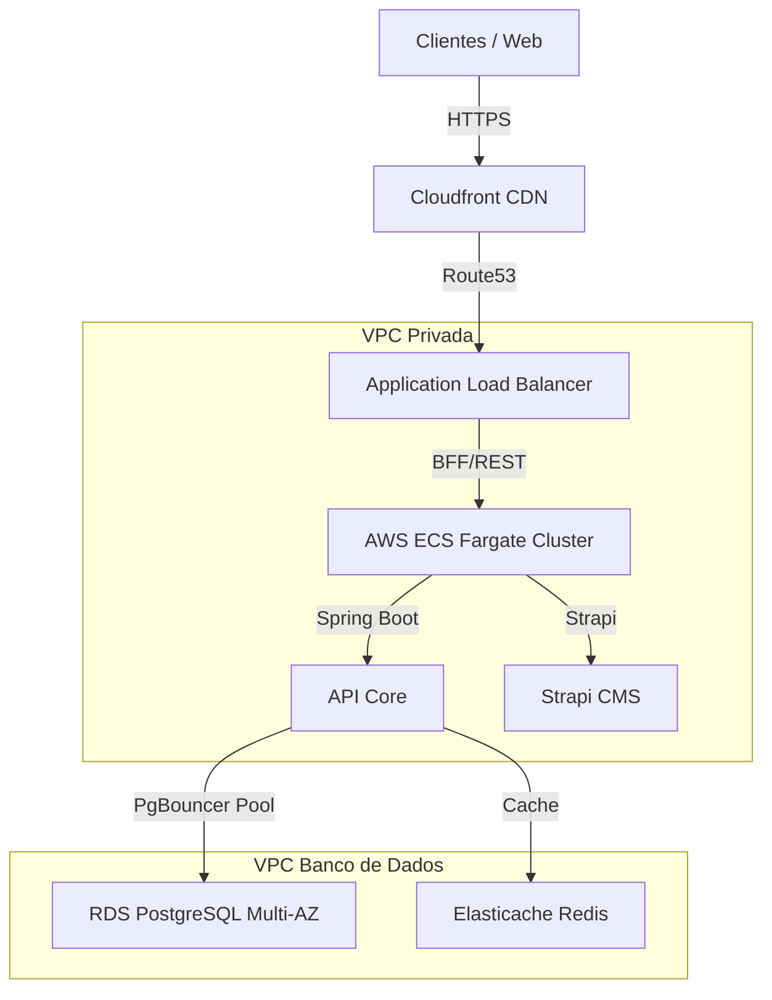

# Relatório de Implantação e Arquitetura em Nuvem (SaaS Multi-tenant)

Este relatório descreve a estratégia de arquitetura e infraestrutura de nuvem recomendada para o sistema de **Gestão Inteligente de Escalas**, focando em alta concorrência global, segurança de dados (LGPD/Multi-tenant) e escalabilidade linear.

---

## 1. Topologia de Rede e Isolamento de Tenants

A arquitetura SaaS do produto utiliza o modelo **Logical Database Separation (Shared Database, Shared Schema)** com filtragem em nível de aplicação por `companyId`. Para mitigar o risco de vizinho barulhento (*Noisy Neighbor*) e garantir conformidade com a LGPD:

- **Isolamento de Tráfego (VPC):**
  - **Subredes Públicas:** Hospedam os Application Load Balancers (ALBs) e o Cloudfront/CDN.
  - **Subredes Privadas (App Layer):** Hospedam os containers Spring Boot e Strapi, sem IP público direto.
  - **Subredes Isoladas (Data Layer):** PostgreSQL, Redis e RDS, acessíveis apenas pela subrede privada da aplicação.

---

## 2. Escalabilidade de Banco de Dados e Concorrência

Para suportar milhares de funcionários registrando ponto e gestores alterando escalas concorrentemente em tempo de execução:

1. **PgBouncer (Connection Pooling):**
   - Configurado em modo *Transaction Pooling* para reduzir o overhead de conexões do Hibernate, permitindo escalar o número de instâncias de aplicação sem saturar o banco de dados.
2. **Read Replicas:**
   - O tráfego de leitura (emissão de relatórios de folha, painel do gestor de mil, etc.) é direcionado para **Read Replicas** do RDS, desonerando o nó primário (escritas de ponto e escalas).
3. **Optimistic Locking (@Version):**
   - Enforce de controle de versão concorrente nas tabelas `work_shifts` e `employees` para prevenir a colisão de alterações simultâneas (*Lost Updates*).

---

## 3. CI/CD e Infraestrutura como Código (IaC)

A implantação em nuvem é 100% automatizada e declarativa:

- **IaC (Terraform):**
  - Definição de VPC, Clusters ECS, instâncias RDS e políticas de segurança (IAM) em repositório de infraestrutura separado.
- **Pipeline de Deploy (GitHub Actions):**
  - **Etapa 1:** Compilação Maven (`mvn clean package`) em container JDK 25.
  - **Etapa 2:** Execução completa da suite de testes de integração.
  - **Etapa 3:** Build de imagem Docker multi-arch e publicação no Amazon ECR.
  - **Etapa 4:** Update do ECS Task Definition e acionamento de *Rolling Update* (Zero Downtime).

---

## 4. Segurança e Segurança no Trânsito

- **WAF (Web Application Firewall):** Bloqueio de IP por geolocalização e proteção contra XSS e SQL Injection.
- **Secrets Manager:** Utilização de Secrets no runtime do ECS para evitar exposição de senhas de banco ou chaves de API nos arquivos do container.
- **CORS Estrito:** A API aceita requisições exclusivamente originadas do subdomínio da aplicação (`app.escala.local` ou equivalente).
